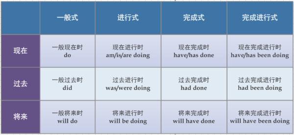

# 补充

1. 时态
1. 英语语法的框架、轮廓

## 时态

- [知乎 - 如何准确使用时态](https://www.zhihu.com/question/31924369)
  - [回答 1](https://www.zhihu.com/question/31924369/answer/196401680)
  - [回答 2](https://www.zhihu.com/question/31924369/answer/53919190)
  - [回答 3](https://www.zhihu.com/question/31924369/answer/138024691)

什么是时态? 时态就是表示一个动作发生的**时间**和所处的**状态**。

- "时" 就是这个动作发生的 "时间"
- "态" 就是这个动作在某个时刻的 "状态"

时：

- 过去时 (past)
- 现在时 (now)
- 将来时 (future)
- (过去将来时...)

态：

- 一般式：经常发生的动作，动词形式为 do
  - I often get up at 7.
- 进行式：正在进行的动作，动词形式为 "be 动词 + doing"
  - She is singing a French song.
- 完成式：对 "之前发生动作" 的一个总结，动词形式为 "have + done"
  - They have found the missing child.
- 完成进行式：对 "正在进行动作" 的一个总结，其动词形式为 "have + been + doing"
  - I have been reading books for 2 hours.

在英文中，时被称为 tense，而态，实际叫体，英文为 aspect。因此上面四种态又分别叫：

- 一般体 (simple aspect)
- 进行体 (progressive aspect)
- 完成体 (perfect aspect)
- 完成进行体 (perfect progressive aspect)

(perfect --> 完成，这也行...)

因此，四种时和四种态组合起来，就形成了英语语法中的十六种时态 (妈呀!)...

(上图中略去了过去将来时)

## 英语语法的框架、轮廓

- [知乎 - 怎么学好英语语法](https://www.zhihu.com/question/24485886)
  - [回答 1](https://www.zhihu.com/question/24485886/answer/215964793)

词性和句子成分：

1. 词性：名词，动词，形容词，介词，代词和副词。
2. 句子成分：主语，谓语，宾语，表语，定语，状语，补语。

一种词性可以充当多个句子成分，比如 名词 可以充当 主语、宾语、表语，(所以像主语、宾语被称为名词性句子成分)，动词一般就充当谓语了，但动词的分词和

五种简单句：

1. 主 + 谓

   You jump, I jump.

   你跳，我也跳。

1. 主 + 谓 + 宾

   I see you.

   我懂你

1. 主 + 谓 + 宾 + 宾

   I gave him my book. 

   我把我的书给他了。

1. 主 + 谓 + 宾 + 补

   Love makes man grow up or sink down.

   爱使人成长，也使人沉沦。

1. 主 + 系 + 表

   You are my world.

   你是我的全世界。

定状补：

- He went to Beijing **by plane**.
- 他**坐飞机**去北京。
- I didn't sleep **yesterday**.
- 我**昨天**没睡觉。
- He had lunch **at 3 p.m**.
- 他**下午三点**吃的午饭。
- He chatted with me **on Weixin**.
- 他**在微信上**和我聊天。

汉语和英语的区别：

- 汉语是：主语 + 废话 + 谓语 + 宾语。
- 英语是：主语 + 谓语 + 宾语 + 废话。

定状补，就是废话。除了主谓宾或主系表之外的成分，都是废话。

(这么一看，还真是耶，从上面例子来看，汉语把一句话的动词部分放在句子尾部，但不是最后，最后是宾语，和日语几乎一样，日语的宾语在动词谓语前，日语中动词谓是真的在最后面。)
