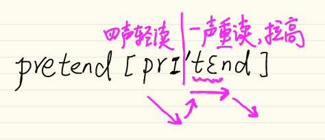
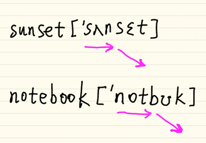
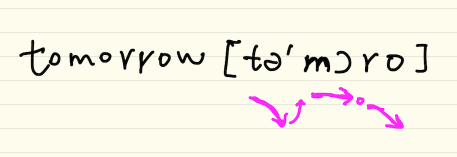
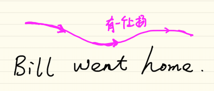

## Unit 4 - 重音练习

此部分内容在第 20 - 21 集。

(这一单元的笔记不太好用电子文档的形式体现，已保留手写的笔记并拍照制成 PDF 保存。)

### Part 1

在单音节，双音节，三音节以及四音节中，重音的规则。

单音节，双音节，三音节，四音节，指的是一个单字或多个单字连起来念，发音中母音的个数，不是指母音字母的个数哦，而是指音标中的母音个数。只有一个母音的自然就是单音节，有两个母音的为双音节，依此类推。

发音中，子音都是轻读的，只有母音才有重读，且必然有一个母音是重读的。但在不同的音节中，这个重读音所在的位置和发声的感觉是不一样的。这一部分就是来总结这些规则。

#### 单音节

在单音节中，因为只有一个母音，因此这个唯一的母音必然是重读的。

- 在单音节中，重读的母音发四声且重读，其余子音发轻声
- 其余音节中，重读的母音发一声且重读，其实母音发四声且轻读 (四声，一种下降的趋势)

单音节：子音 (轻读) + 母音 (四声重读)

例：go [go] / cat [kæt] / beat [bit] / stop [stɔp]

stop [stɔp]，实际发音 [sdɔp]，因为 [s] 和 [t] 都是无声子音，放在一起念起来很费劲，所以实际发音会把第二个无声子音念成对应的有声。

#### 双音节

双音节中，重音有可能在第一音节或第二音节。(这不废话吗，哈哈)

重音在第二音节的例子：

- tonight [tə'naɪt]
- pretent [prɪ'tɛnd]
- a dog [ə'dɔg]
- who knows? [hu'nos]

**a dog**
- a 是冠词，是非机能语，dog 是内容语，像冠词，介词这些非机能语，不重读。
- dog，当它作为一个单字单独发音时，因为是单音节，所以发四声重读，如果它处于多音节中时，发一声。

重音在第一音节的例子：

- sunset ['sʌnsɛt]
- modern ['mɑdɚn]
- notebook ['notbʊk]

notebook，note 和 book 作为独立的单字，单独念时，都念四声重读。note 单独发音时，[t] 发音明显，当它和别的子音一起时，为了节省，[t] 发得不明显，像是含在嘴里。

#### 三音节

重音在第一个音节：

- calendar ['kæləndɚ]
- article ['ɑrtɪk(ə)l] l 算半个母音，[t] 要发成有声有 [d]
- digital ['dɪdʒɪtl] l 半母音，省略了 [ə]
- 'show me one

重音在第二个音节：

- tomorrow [tə'mɔro]
- potato [pə'teto]
- a 'fruit cake
- I 'love you

重音在第三个音节，此时第一音节为次重读音 (第二高的音，但不用太在意)：

- refugee [,rɛfjʊ'dʒi]
- engineer [,ɛndʒə'nɪr]
- ,on the 'bus
- ,what a 'jerk!

在句子中：

- 'Bill went 'home. Bill 重读，went 轻读，home 重读。名词/形容词/副词在句中一般重读，动词看情况，这里是轻读。介词轻读。
- 'School is 'fun. school 和 fun 重读，is 轻读。
- 'Tom made 'lunch. Tom 和 lunch 重读，made 轻读。

#### 四音节

重音在第一个音节：

- hospitable ['hɔspɪtəb(ə)l]，l 半母音
- dictionary ['dɪkʃənɚrɪ]，[ʃənɚ] 再次出现借音，n 借给前面的 [ʃə]
- baby-sitter 保姆
- race car driver

重音在第二个音节：

- invisible [ɪn'vɪzəbl]
- potato chip，2 个名词在一起，重音以前面一个名词为主
- how 'old are you?
- what 'time is it?

重音在第三个音节，第一个音节次重读：

- imitation [,ɪmɪ'teʃən]
- introduction [,ɪntrə'dʌkʃən]
- what's the 'matter? matter 是句子的主题中心
- put your 'hands up? s 和 up 连读

重音在最后一个音节，不会出现在单独的单字中，而是在句子中：

- I want to 'know.
- we played all 'day.
- we took my 'car. 突出 car，car 是中心

(哦，难道这就是为什么我总是觉得公司的同事说英语时，最后总是升调的原因?)

名词和形容词在句子中重音：

- 'Bears are 'fussy. (bears 和 fussy 重读)
- 'Cats eat 'fishes. (cats 和 fishes 重读)

在句子中，怎么知道哪个读重音？

名词为首的情况：

- 'Joe bought a 'book. Joe 和 book 重读，前高后高。
- 'Ed took my 'car. Ed 和 car 重读。
- 'Sams in a 'bar. Sams 和 bar 重读。

句子的强调重点在哪，那部分就要重读。

### Part 2

学习重点。一般情况下：

1. 在句子中，内容语重读，内部容包括名词、动词、形容词、副词。如果同时出现，看句子强调哪部分，就重读哪部分。
1. 非机能语，不重读，包括冠词、介系词、连接词、助动词、代名词。

但是，"我吃了一个苹果"，如果要强调吃的是一个，不是两个，那么 a/an 也是可以重读的。这些规则不是绝对的。

重点，不要把英文当成中文来念，把每一个字都念得那么清楚，要圆融。

练习。

big / box: 单独念，四声重读。

在句子中：

- It's 'big. (big 一声)
- It's a 'box. (box 一声)
- It's a big 'box. (box 一声)
- It's very 'big. (big 一声)
- It's a 'very big 'box. (very 和 box 一声)

谢老师的题外话，关于英语听力练习，对于英语这种语言，不可能每个单词都能听得非常清楚，抓住重音的那些单词，那些是重点，轻读的可以忽略。(我觉得过于理想了...)

good / book (adj / n)，adj + n 时，重音一般放在名词上。

- It's 'good. (good 一声)
- It's a 'book. (book 一声)
- It's a good 'book (book 一声)
- It's really 'good. (good 一声)
- It's a 'really good 'book. (really 和 book 一声)

phone / book (n / n)，双名词时，重音一般放在前面的名词上。

- It's a phone.
- It's a book.
- It's a 'phone book. (phone 一声)
- It's an open 'phone book. (phone 一声，open phone book，adj + n + n，adj + n 时，重音在 n 上，n1 + n2 时，重音在 n1 上)
- It's a 'phone book listing. (phone 一声，listing，动名词，动+ing 作了名词)

一个句子中，名词重读，但代名词却不再重读。代名词，代替名词，指代的内容大家都已经知道了，所以不是需要强调的内容。(也不见得吧...)

- 'Mike loves 'Mary. / He 'loves her. (第一个句子中 Mike 和 Mary 重读，loves 轻读，但在第二句中，He 和 her 轻读，loves 重读)
- 'Jeam sees 'Tom. / She 'sees him. (同时上面，第一句中 Jeam 和 Tom 重读，第二句中 sees 重读)
- 'Eric hates 'English. / He 'hates it.

比较。在句子中，有些单字虽然发音相同，却因为重音节在句子中的位置不同而产生不同的意思。另外，名词各有各的重音节，但复合名词的重音节则是落在最前面。

- an 'English teacher. (教英文的老师，English 是名词，重读)
- an English 'teacher. (英国老师，English 是形容词，不重读，这里重读的是 teacher)

- a 'green house (温室，green 是 n，n1 + n2，重读 n1，因此这里 green 重读)
- a green 'house (绿色的房子，green 是 adj，因此重读 n，house)

- a 'woman doctor (妇产科医生，woman 是 n，重读)
- a woman 'doctor (女医生，woman 是 adj，因此重读 doctor)

- Peter: How was your vacation?
- Mary: Pretty 'good. (很不错呀。good 重读)
- Mary: 'Pretty good. ("真的" 很好。pretty 重读)

- Jack: How many are left in the basket?
- Joe: Not 'one. (不止一个。one 重读)
- Joe: 'Not one. (一个也没有。Not 重读)

看句子强调的部分，强调哪个部分，就重读哪个部分。

- It's 'on the table, not 'under the table. (强调是在桌子上，而不是下，所以重读 on 和 under，即使它们是介词)

- 'I didn't steal the money. Someone 'else stole it. (强调是我没偷，是其它人偷了，因此重读 I 和 else)
- I 'didn't steal the money. 'That's not time at 'all. (强调过去那个时间我没有偷，因此重读 didn't, that, all)
- I didn't 'steal the money. I just 'borrow it. (强调并没有进行偷这种动作，而是借，因此重读 steal 和 borrow)
- I didn't steal 'the money, but I stole some 'other money. (强调并没有偷这点钱，而是偷了其它钱，因此重读 the 和 other)
- I didn't steal the 'money, I had stolen some 'jewelry. (强调偷的并不是钱，而是珠宝，因此重读 money 和 jewelry)

(所以，还是靠语义来重读比较靠谱吧)
