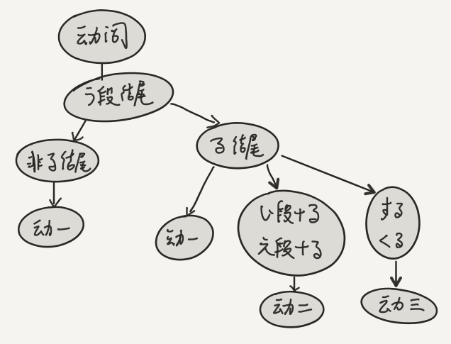
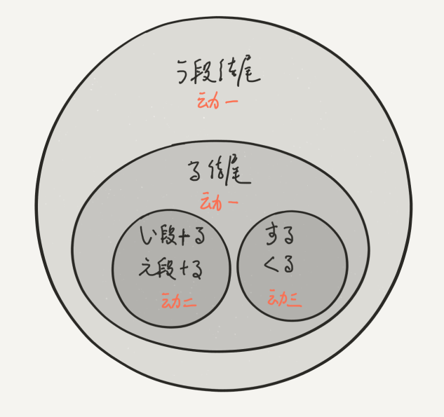

# 新版标准日本语初级 笔记

## 序

学习来源：

1. 上海大学外语学院线下课程
1. 新东方唐盾老师的网络课程
   - ~~[上册](http://www.bilibili.com/video/av3112422/)~~
   - ~~[下册](http://www.bilibili.com/video/av3135469/)~~

Wiki:

1. [日语](https://zh.wikipedia.org/wiki/%E6%97%A5%E8%AF%AD)
1. [日语语法](https://zh.wikipedia.org/wiki/%E6%97%A5%E8%AF%AD%E8%AF%AD%E6%B3%95)

课本上的内容讲解已经很详细了，所以本笔记只作为课本上的内容的一些额外补充。

## 基础 - 五十音图

- 声调
- 送气音 / 不送气音
- 直音
  - 短音
    - 清音
    - 浊音
    - 半浊音
    - 鼻浊音
    - 拨音
  - 长音
  - 促音
- 拗音
  - 拗长音

(2016/3/28 - Sunday)

声调，送气音 / 不送气音。

u う 不像中国的 wu，嘴唇是往外翘的，日语中的 u 嘴唇不往外翘。

声调：高低型，不是英语中的轻重型。0 调，1 调，2 调，3 调，4 调...(我个人的总结 高声调念一声，低声调念非一声，如 3 声，4 声)。

日语句子中，每个实词后跟助词。

    送气：   ka ki ku ke ko   — 位于单词第一个音
    不送气： ga gi gu ge go   — 位于单词非第一个音，节省气流

- 浊音：震动声带
- 不送气：不震动声带

音读：いす 椅子，发音和古汉语类似，从中国古代某地传过去的音。

元音无声化：ちかい (ち 和 か 之间的 i 无声)。

を o 老日本人也读 wo，助词，只会出现在句子中，不会出现在单词中。

(2016/4/4 - Sunday)

- 拨音：ん さん
- 浊音
- 鼻浊音
- 半浊音：ぱぴぷぺぽ (papi 酱 ??) 标志外来语，非词首读不送气音。

以上所学皆为短音，有短则有长，接下来看看长音。

长音：

1. あ 段假名后加 あ
1. い 段假名后加 い
1. う 段假名后加 う
1. え 段假名后加 い (加 え 的很少)
1. お 段假名后，原则上加 お, 但实际上大部分情况加 う

特殊情况：おおきい，最后的 い 是用来表示形容词的，不能和前面连读。(哦，作为形容词尾的 い 并不作为长音连读。)

寒暄语：

- おはよう　ございます
- ごんにちは
- こんばんは

日语：句子越短，越随意；句子越长，越尊敬。

促音: 小写的 つ。

以上所学皆为直音，接下来学习非直音，即拗音。

拗音：为了拼写中文里的音才出现的，い 段假名和 や 行假名的组合。

拗长音：

- 在 や 拗音后加 あ
- 在 ゆ よ 拗音后加 う

(2016/4/10 - Sunday)

输入法输入日文：

1. nn --> ん
1. 促音后面只有 sa，ta，ka，pa 四种辅音，没有 ba 行，所以把促音后面的辅音打两遍就出来促音

   ちょっと　　きっさ

1. 拗音 kya，kyu，kyo

   きゃ　きゅ　きょ

1. 变汉字：回车

   喫茶店

寒暄：

- どうも 非常

罗马字的长音：

- 东京：とうきょう TOKYO 理论上应该是在两个 O 上加一横。

## 第一单元 - 小李赴日

这一单元的重点：

- 存在句，肯定句，否定句，疑问句 (一般疑问句和特殊疑问句)
- 名词和代词 (体言)
- 名词做谓语的使用

体言：名词、代词和数词的总称，可以做句子的主语、补语、宾语，也可以和断定助动词结合起来做谓语，没有词尾变化。

用言：动词、形容词和形容动词总称用言。用言可以独立作谓语，也可以独立作定语 (连体修饰语) 或状语 (连用修饰语)，不过根据后面所接续的助词，必须改变语尾，即**活用**。

### 第 1 课 - 李さんは　中国人です

1. 存在句的肯定式，否定式和一般疑问式：

   - 肯定：nは　nです
   - 否定：nは　nでは　ありません
   - 一般疑问：nは　nですか

   助词 は 提示主题，这里也用来表示主语部分。(一般情况下用 が 来提示主语，用 は 来表示主题，主语和主题并不完全相同。)

1. 表示从属：nの n

#### 存在句的肯定

    私、あなた、王さん、李さん、小野さん は

身份，属性，性别，后面跟助词 は (wa)，wa 不是 "是" 的意思，在这里没有意义。

    中国人、留学生、大学生、日本人 です 
    
です 用于判断性别，身份, "是"，相当于英语中的系动词。

日语分 实词，虚词；虚词跟在实词后面，在虚词后面断句，虚词要轻读。

#### 否定句

否定：では ありません

书面语：じゃ ありません

#### 疑问句

疑问：ですか。 (注意，日语不用问号)

回答：

- 肯定: はい　そうです
- 否定：
  - いいえ そうでは ありません
  - いいえ ちがいます

#### 从属 の

中文不一定要把 "的" 说出来，但日语 一个名词 + 另一个名词，之前必须有 の。

- 中文：我妹妹英语书的第 13 页
- 日语：我的妹妹的英语的书的第 13 页

日语中很少用 あなた，知道对方的姓，就直接用姓名替代

初めまして、私は黄です、どうぞよろしくお願い

(2016/4/17 - Sunday)

日语中本来没有拗音，后来中文传过去后，为了发一些中文的音，才有了拗音。

- 中文里有后鼻音的音 (如 xing 兴奋)，在日语中是长音
- 中文里没有后鼻音的音 (如 xin 相信)，在日语中用 ん 结尾

### 第 2 课 - これは　本です

事物指示代词，及特殊疑问句。

1. `これ / それ / あれ` : 代词
1. `この / その / あの + n` : 修饰名词即体言，所以它们是连体词
1. `どれ / どの` : 哪一个，哪一个的，特殊疑问词
1. `だれ / どなた` : 谁，特殊疑问词，后者是礼貌说法
1. `何(なん)`

#### 代语

    これ　それ　あれ　どれ
    この　その　あの　どの    (连体词)　
    だれ　どなた

    これ　この  近称
    それ　その  中称
    あれ　あの  远称
    どれ　どの  疑问称

#### 特殊疑问词

5W1H: who, when, where, what, why, how, whose, which

- (what) - 何 (なん) ですか
- (which one, which one’s) - どれ どの
- (who) - だれ / どなた

日语的句子，音调是平的，没有太多起伏。

亲属：说到自己的亲属和别人的亲属，用不同的称谓，中文里也有这种情况，令堂，令尊，家父，家母，贵司，鄙司。

どうぞ：これを どうぞ 请收下这个

### 第 3 课

#### 数字

基数词 1，2，3，4，5，6，7，8，9。

基数词后面加一些量词时，比如 歳，基数词会发生音变。

- 一階 (いっかい)
- 三階 (さんがい)
- 六階 (ろっかい)

基数词后面加量词后，一三六八容易发生音变，一六促音变，三浊音变，八是什么变?

#### 位置，方向

    ここ　　　　こちら
    そこ　　　　そちら
    あそこ　　　あちら
    どこ　　　　どちら

    どこ （where)

其它语法见课本。

#### 助词

(2016/4/24 - Sunday)

区分 主题 与 主语：芒果 你 吃吗？(芒果 是主题，你 是主语，主语是动作的执行者，主题是句子的重点)

助词：

- 格助词
  - 主格 が
  - 宾格 を
  - 从属格 の
- 提示助词 は、も
- 终助词 か(疑问) ね(感叹)
- 其它 に で へ

#### 谓语

谓语由什么构成，分四种：名词，动词，形容词，形动。

每一种有 4 种时：现在肯定，现在否定，过去肯定，过去否定。

日语只有 4 种时，时并不发达，但 体 和 态 发达，助词发达。(相反 英语 时发达，体、态可能并不发达，每种语言都有自己的特点，要充分理解这种不同。)

### 第 4 课

这一课的主题是：动词做谓语。

名词做谓语： 私は　学生です

动词做谓语：

(存在)

- あります:  无意志，不能动
- います:  有意志，能动

存在句是动词谓语句。

#### 语法

    (场所) に　(主语) が　あります / います

何：

- 做主题：なに　
- 做谓语：なん

主语变主题：格助词 が 变成 は

尊称，客气，在前面加 お 或者 ご

## 第二单元

动作：吃喝拉撒行 (在何时，何地，何种方式)

日语有 7 种补助格，今天讲 に (に 有 12 种用法)

- (地点) に
- (时间) に

日语动词也分：短暂，持续性

- 在某个时间，用 (时间) に
- 从几时开时，到几时结束，用 から　まで

(2016/5/2 - Monday)

- 存在动词：静态
- 动作动词：动态

日语的 时 很简单，两种：过去时，非过去时 (将来时和现在时一样对待)

- 日语的 体 (aspect) 和 态 (voice) 很复杂。
- 英语中 态 只有两种，主动和被动态，日语有 5 种。

いつ　ですか  (什么时候?)

いつ 询问的时间可大可小。

君(くん) 用于 上级对下级，年长对长幼 使用。

いつも(平时) は (は用来强调对比)

ごろ (左右，只能跟在时间后面)

### 第 6 课

    (目的地/地点)へ (交通工具)で (移动动词: 来/去/回)

いっしょに：一起，但是如果某个事情本身就需要两个人一起做，比如结婚，那就不要加 いっしょに

### 第 7 课

动作的对象

动词：

- 及物动词 (它动词): 吃,吃什么 / 写, 写什么
- 不及物动词 (自动词): 不需要宾语，起床, 工作

语法:

    [宾语] を [动词]

します = do/play/have/make... 意义很广泛

有些动词，有时候是自动词，有时候是它动词，比如 学习。他每天学习；他学习日语。

(2016/5/8 - Sunday)

    动词原形/简体： 飲む       読む
    敬体：         飲みます   読みます

简体 --> 敬体：む --> み + ます (まみむめも) 同一行内的转换

语法：

1. [宾]を    [动词]
1. [场所]で  [动词]
   - [场所]に 表示一种静态
   - [场所]で 表示一种动态
1. Aと B - A 和 B
1. Aか B - A 或者 B

注意：と	か 不是格助词

- 电视剧：テレビドラマ
- 早饭：朝ごはん（あさごはん）
- 中饭：昼ごはん（ひるごはん）
- 晚饭：晩ごはん（ばんごはん）

### 第 8 课

继续围绕动词

语法：

1. [工具/原料]で  [动词]
1. [对象]に  [动词]
   - Aは  Bに  Cを  あげます
   - Aは  Bに  Cを  もらいます

1. [人]に  [名]を 动

   人是动作对象，间接宾语；名词是动作的宾语，直接宾语。就像英语中的 give something to sb. / give sb something.

- もく  经常
- いつも  总是

### 第 9 课

形容词作谓语。

形容词后面都有 い。

- もの  物
- たべもの  食物     
- のみもの  饮料

形容词作定语，不用加 の。

语法：

1. 形容词做谓语
1. 形容词做定语

です 的作用：

1. [名] です：断定助动词 (敬体/简体都一样)
1. [形] です：敬体助动词，简体省略。

### 第 10 课

二类形容词 (专业书称之为 形容动词)。二类形容词，以 だ 结尾，但是书中省略掉了。

专业的书，将这种二类形容词称之为 形容动词，在 文言文 (日本古文) 中是按动词变化。它的时的变化和名词作谓语的变化是一样的。 (です --> でした)

其它分类：

1. い 形容词
1. な 形容词

谓语到此就全部学完了，但目前学的都是敬体，将来还要学简体。

接下来学习复句。

(2016/5/22 - Sunday)

も 跟在格助词后面，可以把作为主格的 が，宾格的 を 覆盖掉，不能把其它的格助词覆盖掉。

の 代词

### 第 11 课

语法：

1. [人]は  [名]が  [形/形动]です (好きです / 嫌いです) 

   [名] --> 对象语

1. [名]が  できます 

   我会 xx / 我能 xx

1. [人]は  [名]が  [形/形动]です / [动词]ます

1. と か や
   - Aと  B        A 和 B
   - Aか  B        A 或 B
   - Aや  B (なと)  A 呀，B 呀  举例，一口气说不完

1. ~ から　

   だから 用于复句。

1. に/で が
   - 〜に　〜が	在某地有某物
   - 〜で　〜が	在某地进行某动作

1. 〜より，最后一个格助词，且于比较

(2016/6/5 - Sunday)

关键语法：数词与助数词

1　枚。1 是数词，枚 是助数词。这部分内容直接看书上，注意数词的变音。

单句 --> 复句

关键是谓语的类型，谓语：

1. 名词做谓语
1. 形容词谓语  (い)
1. 动词谓语
1. 形容动词谓语 (だ)

如何连接单句，用 て，动词接续。

#### 动词分类

到学日语最关键的地方，动词的分类。

教程上是分为了 动一，动二，动三，但一些语法书上是分为了 一段动词，五段动词... 不要担心，原理是一样的，只是叫法不一样。

动词：词干 + 词尾。词干表意义，不会变化，在不同情况下变化的是词尾。

动词的词尾全部都是 う 段，共有 15 个，除去已经不常用和重复的 6 个，剩 9 个。

- う
- く / ぐ
- す / ~~ず~~
- つ / ~~づ~~
- ぬ
- ~~ふ~~ / ぶ / ~~ぷ~~
- む
- ~~ゆ~~
- る
- ~~う~~

动词按词尾分为三类，谨记这几条规则：

1. 不以 る 结尾的都是动一。(可以看出动词中 る 的重要性)
1. 以 る 结尾的动词再按不同的情况分为 动一，动二，动三。(所以 动二，动三 都是以 る 结尾)
   - 动三只有两个动词 (不包括其扩展)：
     - する - 做
     - 来(く)る - 来
     - す 和 く 也都是 う 段
   - 动二，有两种：
     - 以 い 段假名 + る 作为词尾的动词
     - 以 え 段假名 + る 作为词尾的动词。
   - 其它的都是动一。

另一种视图：

例子：

- 帰(かえ)る : 动一 (因为 え 并没有和 る 一起作为词尾使用)
- 換(か)える : 动二 (因为 え 和 る 一起作为词尾)
- ある : 有，动一
- いる : 有，动二
- 見(み)る : 动二
- 寝(ね)る : 动二

(2016/6/11 - Saturday)

用言：形容词，动词，形容动词

1. 用言可以直接做谓语
1. 分 词干 + 词尾(い / だ / る...) 两部分。词干表意义，词尾表形。变形时词干不能变，变词尾。

体言：名词，数词，代词

1. 可以直接做主语

敬体：です/ます 型

    いく --> いきます
    简体 --> 敬体

- です: 敬体助动词，去掉就是简体
- ます: 敬体助动词

#### 简体变敬体

简体 --> 敬体 (ます 形)，如何变形。

动一：词尾的 う 段变成 同行的 い 段，再加 ます

- 帰る --> 帰ります
- いく --> いきます

动二：直接去掉 る，再加 ます

- 寝る --> 寝ます

动三：去掉 る，把倒数第二个词尾 (う段) 变成同行的 い 段。(有点结合了动一和动二的变形)

- する --> します
- 来(く)る --> きます

所以，综上来看，动词原形都是 う 段作词尾，而 ます 形都是以 い/え 段 + ます 结尾。

#### 动词的 て 形

て 形，连接句子。接下来学习动词如何变 て 形。

动二：和变 ます 形是一样的，去掉 る，加上 て

动三：和变 ます 形是一样的，去掉 る，把倒数第二个 う 段词尾变成 い 段词尾，再加 て

- する --> します / して
- 来る --> きます / きて

动二，动三还可以变 だ 形，规则和变 ます / て 形一样。

动一，则不太一样，动一分四种情况：

1. 以 く / ぐ 结尾，发生 い 音变

   - 以 く 结尾  -->  いて
   - 以 ぐ 结尾  -->  いで

2. 以 う / る / つ 结尾，发生 促音变

   - う / る / つ  --> って

3. 以 ぬ / ぶ / む 结尾，发生拨音变

   - ぬ / ぶ / む  --> んで

4. 以 す 结尾，与 ます 形一样

   - す —> して

唯一例外：行(い)く，不发生 い 音变，而是促音变

- 行く  -->  行って

1. [动]て + [动]ます
1. てから

日语是胶着语，多个动词用 て 连接起来

(2016/6/19 - Sunday)

日词动词的变化，专业术语叫 活用。每个动词有 6 种活用。

- て: 接续动词
- だ: 表示过去，ました 的简体

### 第 15 课

语法：

1. [动]て います

持续体，日语有 6 种体，但只有 2 种时，过去和非过去。

て + います 有 12 种用法：

1. 持续 v + て + います  
2. ...

て + いません：不在干什么

### 第 16 课

形容词做谓语。如果单句变复句，还是用 て，但形容词的 い　-->　く。

其它语法看书上。

1. 瞬间动动词 + て + います

穿戴动作都是瞬间。表示动作结束以后仍然保持的状态。

条件句：

- 假定：逆接 / 顺接
- 既定：逆接 (が) / 顺接 (がら)

- まだ  还
- また  又、再

### 第 17 课

(2016/6/26 - Sunday)

想要什么。在中文中 想要什么 是动词，在日语中用形容词 欲しい。

1. [对象语 名词] + が + 一类形/二类形 です

   好恶，巧拙，能力以及愿望的对象

剩下的看书上的语法。

### 第 18 课

自动和它动，词尾不一样，词干一样。

### 复习

(2016/9/27)

- 4 种谓语：
  - 名词做谓语
  - 形容词做谓语
  - 形容动词做谓语
  - 动词做谓语

- 肯定、否定、过去、非过去

- 格助词：10 个
  - か：主格，对象语
  - の：从属格
  - を：宾格，移动的空间
  - 补助格，相当于英语中的介词，表示时间、地点、人物
    - に：时间，事物存在的地点
    - へ：移动的方向、地点
    - と：和谁
    - で：发生的地点、交通工具、材料
    - から：时间、空间的起点
    - まで：时间、空间的终点
    - より：比较

动词的分类。

动词变型：

- ます --> (＝)ませ　 --> ません (否定)
- ます --> (＝)まし　 --> ました (过去)
- ます --> (＝)ましょ --> ましょう (开始吧)
- ます --> ませんでした (过去否定)

て：表示连接，14，15课共有 6 种句型，て 型很重要!

- て ください
- て います
- ても いいです

16 课，て 连接形容词，名词。

17 课，想要，欲しいです。

18 课，变化，なる 成为。

19 课，动词的 ない 形，否定，请不要做什么。

### 第 20 课

(2016/10/16 - Sunday)

这里的 基本形，其实是指 连体形，修饰名词。

1. 形容词 + 名词
1. 动词(连体形) + 名词(こと)

这就是为什么 这节课的句型语法中，一定要跟一个 こと。因为不能用动词直接做名词性质的主语或宾语。正如英语中不能直接用动词做主语或宾语，而要使用它们的 ing 或 todo 形式。

比如中文："说很简单"。这里用动词 "说" 作为主语。但英语中不能直接表达成："Say is easy"，因为动词不能直接充当名词性质的成分。而必须表达成 "Saying is easy"，或 "To say is easy"。

日语也是这样的，所以用 "动词连体形 + 名词" 共同充当名词性质的成分。"说很简单"，在日语的表述必须是："说，这件事情是很简单的"。

- 中文：我的梦想是去日本
- 日语：我的梦想是去日本这件事情。
- 英语：My dream is going to Japan。

(突然让我对英语的不定式理解了)

### 第 21 课

动词的た形：过去助动词，表达动作完了，相当于英语中的 过去/过去完成 时。主要是要表达一种动作已经完成的意思。

て：接续助词

### 第 22 课

简体与敬体

### 第 33 / 34 课

日语的体 (aspect)。

---

TODO：补充从第 17 课开始的笔记。
